在 C++ 11 中，“线程”这一概念第一次被引进到 C++ 标准的层面。在 C++ 11 之后，用户可以通过下面的方式创建线程，进而发起异步任务：

```c++
#include <future>
#include <thread>
#include <utility>
#include <iostream>
#include <ostream>

int main() {
  std::packaged_task<int(int, int)> task([] (int a, int b) -> int {
    return a * a + b * b;
  });
  auto fut = task.get_future();
  std::thread th(std::move(task), 3, 4);
  auto res = fut.get();
  std::cout << res << std::endl; // Expected output: 25
}
```

当然，标准库还提供了一些便民设施，这里就不一一列举。但是，如果只是发起一到两个并行任务，利用现代计算机的多核心处理器提高程序的计算性能，每个任务单开一个线程尚且足够使用，但要是在实际落地的应用系统中，面对 Web 等任务小且密集的生产环境，如果依然维持这种朴素策略，就不得不面对过多线程产生的巨大创建和调度开销和 Linux 自身对于线程和进程数量的限制。因此，如果此时能够利用池化技术，制造一个线程池，避免频繁创建线程，同时确保线程的数量在一个合理且可以正确调度的范围内，就能有效控制调度开销，同时确保进程的安全。

因此，一个设计合理的线程池，就成为了 C++ 异步开发中，一个不是标准，胜似标准的关键组件。在协程技术流行之前（其实流行之后也差不多），任何一个可以实际投入生产环境的异步 Web 组件，都会默认包含或者依赖一个线程池，用以提升框架的性能。所以，对于想要投身 Web 开发的软件工程师而言，无论是否需要亲自调教线程池的工作，了解线程池的基本工作原理和实现模式对于增进业务总是有利无弊。

## 线程池的基本原理

很多朋友可能已经了解过池化技术，并且已经知道怎么编写一个简单的对象池，理解从池中取得对象，用完后将对象归还的道理。这种方法对于普通对象当然是有用的，甚至对于很多非数据对象，比如 ODBC 连接，这种方法依然可以生效（虽然 ODBC 官方提供了连接池支持，一般无需手动配置）。但是这个方法对于线程池显然需要一点点小的改进：如果我们将一个对象当作一个状态机，那么一个线程被发起之后，它并不像数据库连接和一些常见对象一样，可以轻易恢复到初状态。事实上，一个线程就像一个操作系统中的货真价实的进程一样，在初始化完成之后，就不能回到“新建”状态。所以，我们如果需要将池化技术应用于线程，我们就要保持思想不滑坡，利用人类智慧，对我们的线程模型进行一些改造。

### 可以复用的线程

我们首先需要思考的是一个可以重复利用的线程，只要解决了这个问题，我们就可以把过去的池化经验套用在线程上。如果我们需要将线程变成可以重复利用的，就必须为给线程制造出这样一个状态：这个状态即是线程使用的起点，也是线程使用的终点，至于线程中间的状态，我们不关心。**因此，我们就需要完成线程池设计过程中最大的思维的转换**。我们使用线程，并不只是无意义的行为，相反，我们开启线程就是为了执行任务。那么，如果我们可以在需要用到线程的时候，给一个正在等待任务的线程一个可以执行的任务，我们就相当于拿到了一个正在运行的执行机器，然后利用这个机器完成了我们的任务，再把这个机器归还给我们的池。也就是说，我们要将线程，当成一个蓄势待发的，可以利用的执行机器，而不是一个生命周期不可逆的临时的对象或者不可逆过程。

根据上面的观点，我们可以为一个线程设计出这样的模型：

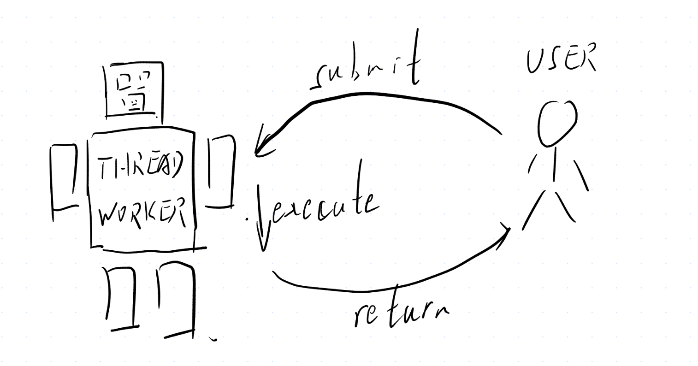

我们现在对于这样的一个“执行机器人”有了一个基本的概念。但是现在我们遇到了一个问题：

- 如果我们在将任务提交给线程工人之后，我们依然必须等待任务完成，为什么我们不自己执行？难道是因为线程被绑定P核然后我们被绑定E核了（笔者不排除这种可能）？

显然，对于大多数的情况下，我们并不介意任务提交之后的结果，正如大多数直接使用 `std::thread` 的朋友一样，我们只关心任务会不会被执行。当然有时我们真的关心结果，但是我们先假定我们不关心，因为在协程和 `co_await` 出现之前，通过一个 `std::future` 等待结果是一种很不好的实践，而正确的实践是 `Asio` 的回调模式以及对于回调模式的一些封装，本文不可能展开讲，不过学会本文之后，应该很容易就能理解这种“异步”模式的逻辑。故我们完全可以这样简化这个机器人模型：

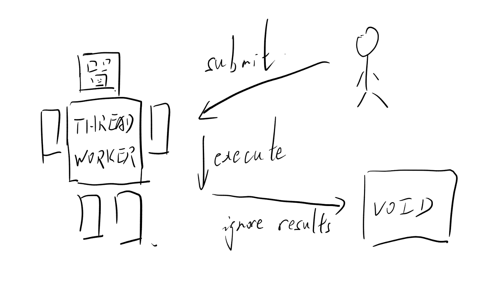

可以看到，在改良线程模型之后，我们可以大大缩短我们持有线程的一个时间，就像拿到了一个 Agent，足不出户就能完成我们的工作。

然而，如果我们发扬我们反对人类智慧的智慧，或者在生活中点过外卖，或者读过一个五人雇佣一个佣人的寓言故事，就会敏锐地发现这样一个问题：

- 如果我们提交完任务，就归还我们的线程，那么这时的线程还处在一个没有就绪的中间状态。此时如果再提交一个任务，我们的机器人不就像中了杨康一匕首的郭靖，人命危浅，朝不虑夕了吗？

所以我们的线程模型还要改进。至于改进的方案，也可以从显示生活中获取：

假设一个团队，有一个社畜程序员，一个项目经历和两个逆天产品经理，三位经理几乎同时向程序员提出了一个需求。那么此时，备受欺凌的程序员如果不想掀桌子，那么他就会将每个经理的任务，按照先来后到的原则，列出一个 TODO List ，就可以按照 TODO 上列出的任务，通过 996 + icu 实现三位经理的全部需求。此时，如果没事找事的产品经理再提出新的需求，可怜的程序员只需要在 TODO List 上附加一个事项，就可以通过加班同时满足新的需求。**因此，我们可以给我们的社畜机器人也设置这样的一个 TODO List。** 这个方案，就是我们常说的“任务队列”。那么具有了 TODO List 的机器人，对外只能观察到一种状态，就是“可以提交”。这种状态，是不是像极了只会说“行，行，好”的社畜程序员。

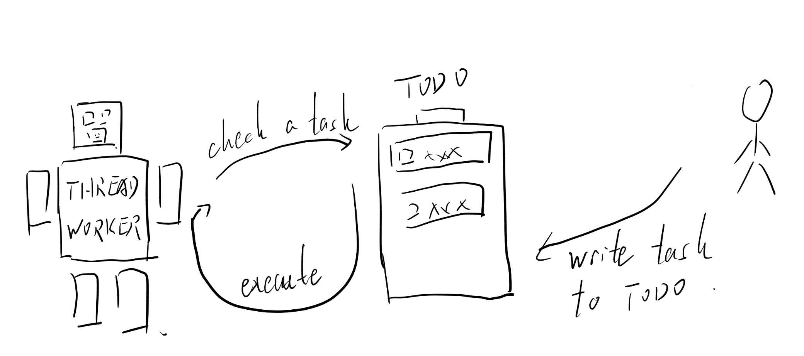

### 如何保证线程的工作饱和

在具有了一个可重用的线程之后，我们可以将线程组织起来，开个公司。那么现在有一个人来取线程：

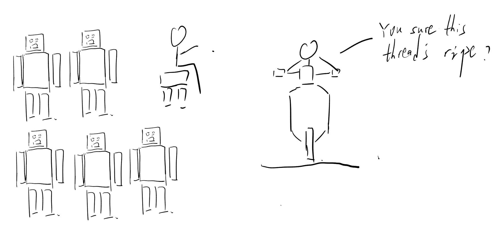

那假设我们是线程池的管理者，我们肯定希望我们的线程都“保熟”，能做让顾客等待的时间最短。这种情况下，一种常见的方法，是比较每个线程的任务队列的长度，但是这种方法会遇到一个问题：就是我们的任务要执行多久，我们并不知道。因此，我们如果找到一个线程，任务队列中只有一个任务，但是这个任务执行了两年半，那么这样的线程显然就“不保熟”。作为线程池的管理者，我们显然不高兴，因为我们的线程不熟，要是被甲方劈了（kill -9 了），对我们恐怕不利。

但是作为资本家，我们再次动用了人类智慧，敏锐地发现：我们的线程会从任务队列中取消息，而每当他们取消息，就意味着他们的上一个任务完成了。因此，我们决定让他们不要从自己的队列取消息了，任务做完了，就直接向敏捷教练汇报，由敏捷教练统一派发任务。那具体的方式，就是设置一个全局的任务队列，完成任务的线程直接从全局任务队列中提取任务。要实现这样的统筹规划，调用者也不需要持有和归还线程了。直接向线程池提交任务，然后坐等收工，就可以高枕无忧。这个时候，线程池就相当于一个外包公司，甲方提出需求，最后由外包公司分摊任务给牛马。

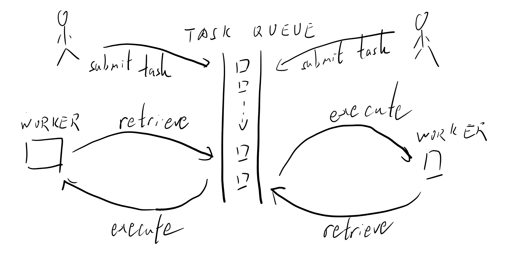

从此，我们就得到了我们的线程池的基本结构，等待任务和全局队列。线程池中的线程不再作为对象被分发给线程池的用户，而是等待用户将他们的任务投入线程池，通过线程从全局的任务队列中等待任务实现线程的池化。

## 实现一个线程池——基础部分

### 线程安全任务队列实现

记得在南京大学蒋炎岩教授的操作系统课程上，曾经有过“一把大锁保平安”的说法。因此，用最稳妥的方式实现一个线程安全的任务队列，最快的方法就是在一个实现很稳健的队列上，加一把全局锁。

因此，我们可以这样声明一个队列：

```c++
template <typename T>
class SafeQueue {
public:
  /**
    * Details...
  */
private:
  std::queue<T> queue_;
  std::mutex mtx_;
};
```

在接口设计方面，因为我们存在这样一个锁，所以我们可以判断失败和成功。因此，我们只要在做任何事情之前把锁加上，我们就可以保证我们的代码不出现正确性上的问题。下面是简单的接口示例，难度不高，朋友们应该一看就能明白：

```c++
bool push(const T &e) noexcept try {
  std::lock_guard<std::mutex> lock(mtx_);
  queue_.push(e);
  return true;
} catch (...) {
  return false;
}

bool pop(T &e) noexcept try {
  std::lock_guard lock(mtx_);
  if (!queue_.empty()) {
    e = std::move(queue_.front());
    queue_.pop();
    return true;
  } else {
    return false;
  }
} catch (...) {
  return false;
}
```

然后，对于每个任务，这里我们使用 `std::move_only_function` 的指针的形式进行存储。这样虽然调用链比较长，速度稍微慢一点，但是对于一般需求来说，这样写不容易出错，而且对于各种可调用对象都可以覆盖。指针在这里不是必须的，只是笔者本人采用了指针。这样选择和后面“快慢队列”的优化有关系，如果想要实现相关功能的同学可以关注一下，反之则直接在队列中存储可移动函数即可。

```c++
class ThreadPool {
  /* ... */
  using ThreadFunc = std::move_only_function<void()>;
  using ThreadFuncPtr = ThreadFunc*;
  SafeQueue<ThreadFuncPtr> task_queue_;
  /* ... */
}
```

### ThreadWorker 的循环

一个线程池中的线程，在被发起之后，这里我们定义为 `START`状态，旋即进入等待循环的过程，定义为 `FREE` 状态。然后，线程从任务队列中取得一个任务，此时线程开始执行，定义为 `BUSY` 状态。最终，任务完成，线程重新回到 `FREE` 状态。当然，如果线程池需要停止了，这个时候线程会从一个 `FREE` 状态最终来到 `STOP` 状态。和操作系统的进程管理机制不同，因为用户无权，也不应该在没有全局的上下文的情况下通过中断强行结束一个线程，所以线程没有可能从 `BUSY` 进入 `STOP`。

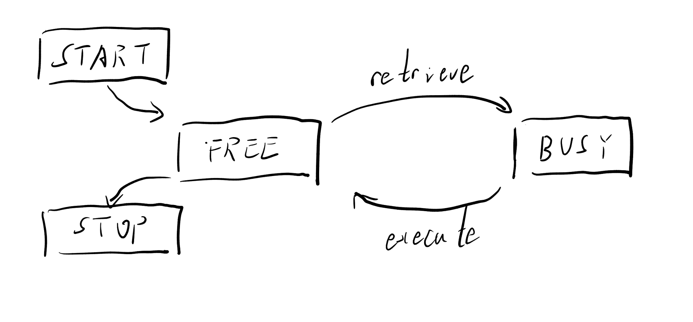

上图中我们描述了一个任务充足的条件下的线程的生命周期。当任务不足时，线程从安全队列中取得任务失败，因此重新回到 `FREE` 状态。所以完整的线程的声明周期应当如下图所示：

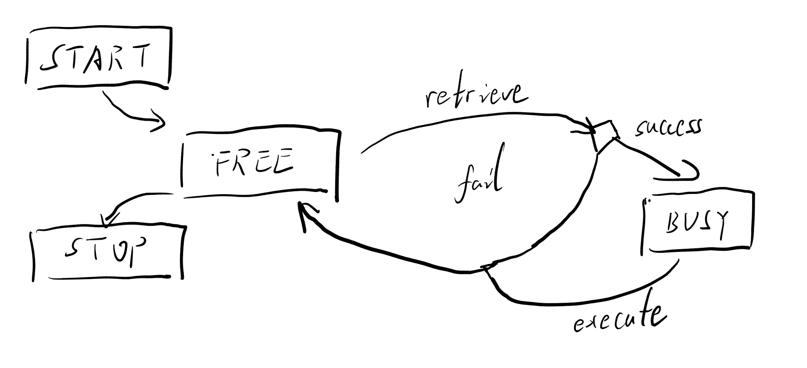

因此，我们可以这样实现一个基础但是**差不多**正确的线程池：

```c++
class ThreadPool {
public:
  template <typename F, typename ...Args>
  void submit(F &&f, Args &&...args) {
    ThreadFuncPtr func_ptr = new ThreadFunc(std::bind(std::forward<F>(f), std::forward<Args>(args)...))
    queue_.push(func_ptr);
  }

  ThreadPool(std::size_t thread_num) {
    threads_.resize(thread_num);
    for (auto &th : threads_) {
      th = std::thread(ThreadWorker{this});
    }
  }

  enum STATUS {RUNNING, STOP};

private:
  struct ThreadWorker {
    void operator()() {
      for (;;) {
        if (pool_->stat_ == STOP) {
          // 从这里转移到 STOP 状态
          break;
        } else {
          // Free 状态
          ThreadFuncPtr func = nullptr;
          pool_->queue_.pop(func);
          // Busy 状态
          if (func) {
            (*func)();
            delete func;
          }
          // 回到 FREE 状态
        }
      }
    }
    ThreadPool *pool_;
  };

  std::vector<std::thread> threads_;
  SafeQueue<ThreadFuncPtr> queue_;
  STATUS stat_;
};
```

### 使用条件量防止 CPU 空转

在我们刚才的实现中，我们发现，在任务较少的时候，有时我们很快就将队列中的任务拿完了。如果我们的任务太少，我们的状态图中，`fail` 分支就会过于频繁地出现。这个时候，我们迫切地需要一种方法，让在城里没有事情干的知识线程，有一种方法消停下来，同时又能“召之即来”。

条件变量，是操作系统的一种典型的并发控制手段。条件变量是一个内核变量，在使用时，用户持有锁，并且将自己的线程“挂起”到条件变量上。此时，用户释放锁，并且线程进入阻塞状态。当条件满足时，满足条件的线程唤醒条件变量，阻塞线程恢复执行。所以，工作线程的流程就会如下图所示：

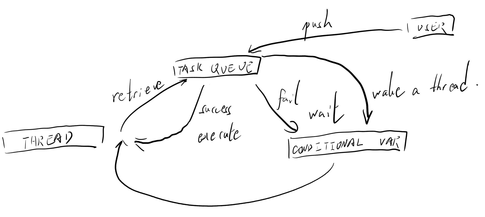

因此，事件循环内部的代码可以如下所示：

```c++
for (;;) {
  std::unique_lock(pool_->mtx_);
  if (pool_->stat_ == STOP) {
    break; // 还是跳出循环
  }
  pool_->cv_.wait(lock);
  /* 剩余取得任务和执行代码 */
}
```

当需要添加任务时，用户可以在 `submit` 函数中添加如下流程：

```c++
/* 将任务添加进入队列 */
cv_.notify_one();
```

这样可以确保在任务添加完成之后，至少有一个线程处于唤醒状态，可以取出任务并执行。

### 使用智能指针管理内存

在我们的实现当中，为了方便管理声明周期，我们使用 `ThreadWorker` 存储线程和待调用的函数，以及用于等待条件的互斥锁，还有各个线程停止状态（即一个线程是否应当停止）封装在一起，以降低生命周期的管理难度。同时使用智能指针管理资源，通过恰当地编写析构函数，确保无需手动进行线程的`join`。当然，选择这种实现方式的主要原因和后续功能增强的需求有关，因此不喜欢这种实现的朋友可以选择参考下面这个教学意义更高的实现：

[ThreadPool: A simple C++11 Thread Pool implementation.](https://github.com/progschj/ThreadPool)

## 实现一个线程池——功能升级

前面我们实现的线程池，已经能把任务塞进去、把线程叫醒、把任务跑完——它大概已经能在你电脑上通过一次 CI，甚至缝缝补补还能在你同事电脑上通过一次（这很重要，因为有时候 CI 只是在你电脑上跑的那位同事）。

但如果你想让它更像一个能进“异步框架生态位”的组件，或者更现实一点：让它在**小任务极其密集**的生产环境里不那么容易被锁开销占用太多性能，那么我们就需要给它做几次功能升级。下面笔者将提供一个本文的参考实现中提供的API：

- 参数：`BThreadPoolParam`（核心/最大线程数、快队列容量、清理/扫描间隔等）
- 提交：`post / dispatch / defer`，以及需要返回值时用的 `futured_post`
- 生命周期：`join / shutdown / restart`

这里有一个很符合现代人作息的设计：构造线程池时**不预启动线程**，线程是按需创建的。你可以把它理解为“编制先给上，但人不一定来上班”，等任务真的来了再招人（这比某些地方良心多了，至少它真的会招）。

### 提高任务获取速度——快慢队列机制

我们在“基础部分”用的任务队列是 `std::queue + std::mutex` 的组合：正确、稳定、好懂，堪称并发界的“老干部”。但代价也很明显：当任务非常小、非常多时，线程花在**抢锁 + 修改队列**上的时间，会显得格外扎眼——你的 CPU cache 还没热起来，mutex 已经把你叫去开会了。

因此，笔者的实现里把任务队列拆成了两条路：

- **快队列**：固定容量、无锁（准确地说，是 lock-free 的 MPMC ring buffer），用来走高频的 `post` 路径
- **慢队列**：一把大锁的 `SafeQueue`，当快队列满了，或者任务主动走慢路径时，就退回这条路


#### 为什么要存“函数指针”：无锁队列要吃“类 POD”

快队列之所以能无锁，是因为它必须对元素类型做一些“约法三章”。在笔者的 `LockfreeFixedQueue<T>` 里，`T` 需要满足：

- **trivially destructible**（析构不需要做任何事）
- **nothrow constructible**（构造不抛异常，至少在队列内部那一套 placement new 的世界里不要整活）

这就意味着：你很难把一个“富有感情的”C++ 可调用对象直接塞进去——比如 `std::move_only_function<void()>` 这种东西，里面可能有小对象优化、类型擦除的状态、析构时要释放资源，它显然不是“类 POD”。

所以这里选择存一个很朴素、很无聊、但非常符合无锁队列审美的东西：**指针**。

```c++
using ThreadFunc = std::move_only_function<void()>;
using ThreadFuncPtr = ThreadFunc*;

LockfreeFixedQueue<ThreadFuncPtr> fast_queue_;
SafeQueue<ThreadFuncPtr> slow_queue_;
```

于是整个任务的生命周期就变成了：

1. 提交方把任务封装成 `ThreadFunc`，然后 `new` 出来变成 `ThreadFuncPtr`
2. 队列里只搬运指针（轻、可复制/移动、析构不需要做事）
3. 工作线程执行完 `(*func_ptr)()` 后 `delete func_ptr`

这看起来像是“用无锁换 malloc”，确实如此——但在小任务高频场景里，抢 mutex 往往比一次分配更让人难受；而且分配这件事之后也可以用 allocator/pool 再优化（这部分我们先不展开）。

#### `post`：从 `submit` 进化来的提交路径

在“基础部分”的简化线程池里，我们把提交接口叫做 `submit`。它做的事情非常朴素：**封装任务 → 入队 → 唤醒线程**。而笔者这里的 `post` 并没有背叛这个祖训——它本质上还是这三步，只是把“入队”这一段扩展成了快慢两条路，并在前后补上了一点“现实主义”的管理流程（比如按需创建线程、快队列满时的降级和扩容）。

大致流程如下图文所示：

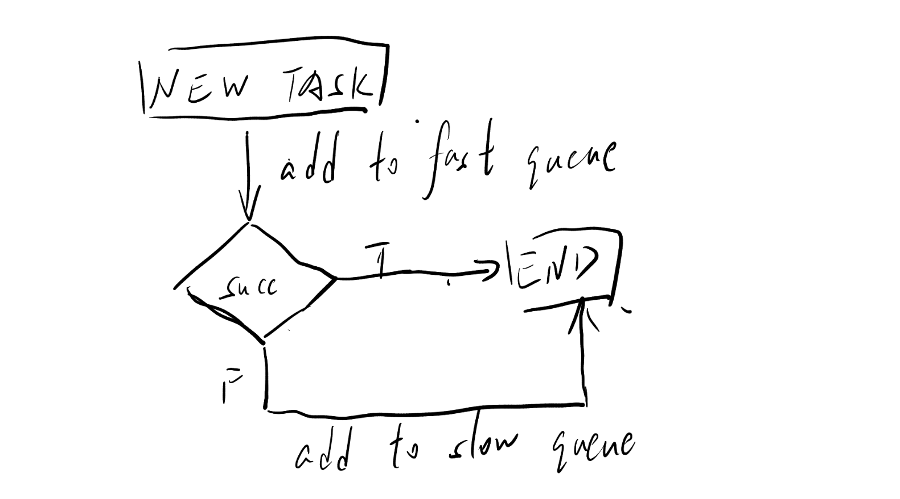

1. **封装任务**：把 `F(args...)` 绑定成 `ThreadFunc`，然后拿到 `ThreadFuncPtr`
2. **补齐核心线程**：如果当前存活线程数 `< core_thread_num`，就按需创建 worker（懒启动）
3. **尝试进入快队列**：`fast_queue_.push(ptr)` 成功则 `notify_one`
4. **快队列满了**：尝试扩容到 `max_thread_num`（后文详述），然后把任务塞进慢队列，`notify_one`

至于 `dispatch` 和 `defer`，你可以先把它们当作“以 `post` 为基准的两种变式”：一个尽量就地执行，一个刻意不插队。为了不把快慢队列这一节写成接口说明书，它们的完整流程我们挪到后面各自的章节中去讲。

#### 防止慢队列“饿死”：周期性回头看一眼

快队列优先级更高，这是它存在的意义；但如果你永远只盯着快队列，慢队列里的任务就可能出现“饥饿”：系统持续有大量新任务涌入快队列，慢队列里那批“等笔者忙完就处理”的工作就会变成“等笔者退休再处理”。

为此，这里做了一个很朴素的公平性补丁：**周期性扫描慢队列**。

直觉上，你可以把它理解成一个加权轮询：

- 大多数时候：优先消费快队列
- 但每隔一段时间（或者每消费若干个快任务）：强制从慢队列拿一个任务执行，给它续一口命

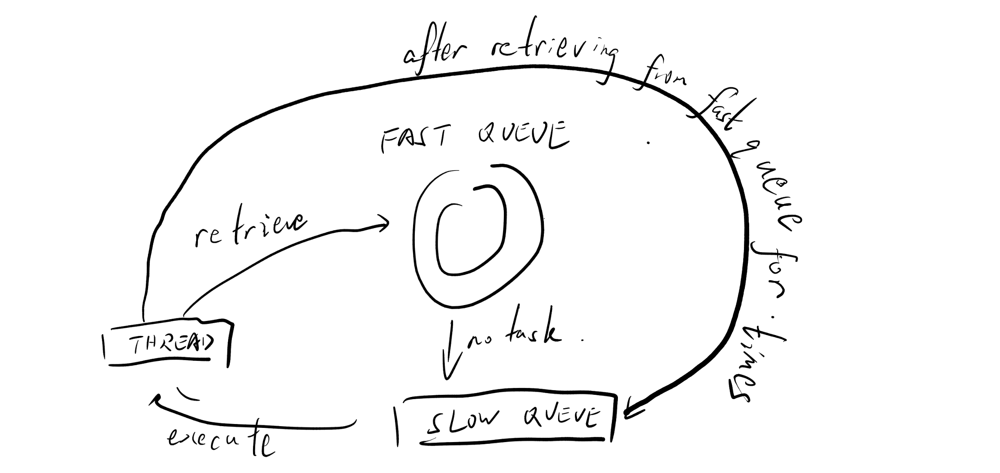

这套机制并不追求“严格公平”（严格公平往往意味着更复杂的锁/原子协议，最后把快路径也拖慢了），目标只是让慢队列**在持续压力下也能偶尔被服务**，避免把“延后处理”误写成“永不处理”。

### 缓存优化机制—— dispatch 的实现

如果把 `post` 当成线程池的“标准提交路径”，那么 `dispatch` 的定义其实非常克制：**能在当前线程就地执行就执行，否则就退回 `post`**。所以 `dispatch` 的慢路径不需要重新发明轮子，它直接继承了 `post` 的快慢队列、扩容、唤醒等全部流程。

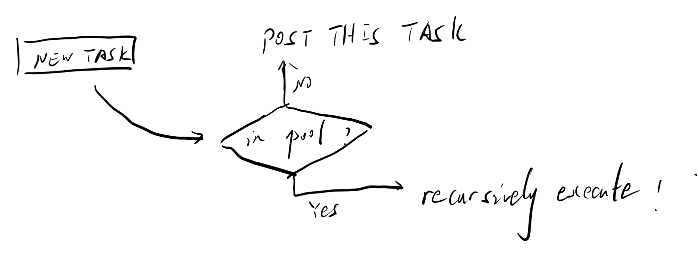

如果你在异步系统里写过一点点回调，你大概率见过这种代码形态：

1. A 任务在 worker 上跑着
2. A 任务做完一小段逻辑，又提交了 B 任务
3. B 任务其实跟 A 强相关，最好能趁热继续执行（数据还在 cache 里）

如果我们一律把 B 重新 `post` 回队列，那么它至少会经历一次入队/出队，甚至还可能被别的线程捡走，导致 cache locality 直接清零。于是 `dispatch` 的目标就很清晰：**当调用方本来就在池内时，尽量就地执行**。

在笔者的实现里，判断“是否在池内”非常直接：线程池维护了一张 `thread_map_`，记录了 worker 的 `std::thread::id`。`dispatch` 先查这张表，如果当前线程 id 在表里，就认为自己是 worker。

但是——这里有一个经典陷阱：`dispatch` 如果总是就地执行，就会很容易写出“回调套回调套回调”的递归链。递归深了，栈就炸了。更糟糕的是，你炸栈的时候往往还在执行某个“看起来只是提交了个任务”的业务代码，现场非常魔幻。

因此笔者用了一个很朴素的防御：**限制递归深度**。

```c++
// thread_local：每个线程一份计数器
static inline thread_local std::size_t dispatch_depth_ = 0;
static constexpr std::size_t kMaxDispatchDepth = 32;

if (is_worker_thread() && dispatch_depth_ < kMaxDispatchDepth) {
  ++dispatch_depth_;
  std::invoke(f, args...);
  --dispatch_depth_;
} else {
  post(f, args...);
}
```

这不是一个“完美”的方案（完美方案通常意味着你要引入更复杂的 continuation 调度器，然后你的线程池就不再是线程池），但它非常实用：大部分时候 `dispatch` 可以直接跑，递归太深时自动退回队列，避免把栈当成无底洞。

### 处理不紧急的任务—— defer 的实现

在很多异步框架（包括 Asio）的语义里，`defer` 表达的是一种态度：**这活儿不急，别插队**。

如果说 `dispatch` 是在 `post` 前面加了一个“能不能就地执行”的判断，那么 `defer` 则更像把 `post` 的入队路线固定死：**同样封装任务、同样唤醒线程，但不走快队列，直接进慢队列**。

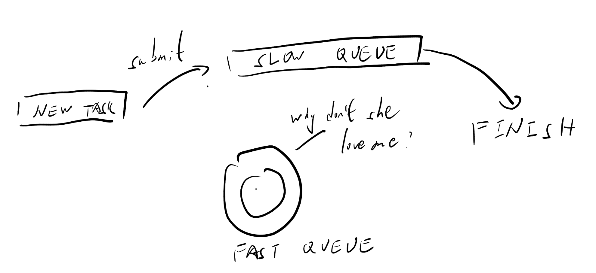

笔者这里把这种态度做得非常物理——`defer` 直接把任务塞进慢队列（并且不会触发“快队列满了就扩容”的那段逻辑）。这样做的好处是：

- 快队列继续为高频小任务服务（尤其是回调链上的“下一步”）
- 一些“可以慢慢来”的工作（日志、统计、资源回收、低优先级补偿逻辑）不会把快路径堵住

当然，代价也很直观：如果你把一件“其实很急”的事情丢给 `defer`，那它就会真的变得不急——因为 worker 默认优先取快队列，慢队列要么等快队列空了，要么等前面提到的“周期性扫描”给它一个机会。

所以你可以把它们理解成三种不同的社畜沟通方式：`dispatch` 是当场解决，`post` 是发邮件排队，`defer` 是先记 TODO，不插队。

### 避免过度等待——线程池的动态扩容

一个固定大小的线程池，在稳定负载下很舒服；但面对突发流量，它就会开始“排队叫号”。如果你做过 Web 服务就知道：很多时候用户不是被你算慢的，而是被你排队排慢的。

所以笔者的实现里加了一个动态扩容的机制，整体思路学习自 Java 的 `ThreadPoolExecutor`：有一个 `core_thread_num` 和一个 `max_thread_num`，平时维持核心线程数，压力上来时可以临时扩到上限。

但笔者只学了 Java 的“扩编”，没学它的“新员工第一天就直接上生产线”。

#### 扩容策略：快队列满了就加人

`post` 的逻辑大致可以概括为：

1. **先补齐 core**：`living_thread_num < core_thread_num` 时按需创建 worker
2. **尝试进快队列**：成功就结束
3. **快队列满**：说明系统当前压力很大  
   - 如果 `living_thread_num < max_thread_num`：尝试再创建 worker（扩容）
   - 然后把任务扔进慢队列兜底

和 Java 的差异点在于：Java 在创建线程时，会把当前提交的任务当作 `firstTask` 直接交给新线程执行；而笔者这里创建线程后，任务依然是**入队 + notify** 的方式被 worker 获取。结果就是：行为上很像 Java 的“线程数量模型”，但实现上更像“先办入职手续（启动 worker loop），再按流程领任务（从队列取）”。

这也带来一个实现层面的好处：线程的主循环逻辑统一，任务获取路径一致；你不用为“新线程的第一份任务”开一个特殊分支。

#### 缩容策略：多余线程在空闲时自我回收

扩容容易，缩容才像真实世界（开会、走流程、填表、盖章）。

笔者的缩容策略相对激进：worker 在发现当前没有任务可取时，会先尝试 `try_cleanup()`：

- 如果当前线程数 `> core_thread_num`，就把自己标记为“该退休了”
- 从 `thread_map_` 里移除自己，并且提交一个“清理任务”去 join 这个线程（避免自己 join 自己）
- 当前线程随后退出循环，结束生命

这套做法的核心点是：**清理动作由别的线程来做**。你不能在当前线程里 `join()` 自己，那不是线程池，那是自我了断。

### 资源管理——避免内存泄漏

讲线程池的资源管理，最容易讲成“这边 `new` 了，那边 `delete`，中间 try/catch 一下”，然后读者就会产生一种错觉：原来 C++ 的精髓是手写 GC。

笔者这里尽量让资源管理优先走 RAII：

- `BThreadPool` 的析构函数里直接 `shutdown()`，确保线程和队列都被收拢
- `ThreadWorker` 自己的析构函数会 `set_stop + join`，确保线程不会飘在后台当孤儿
- worker 用 `std::unique_ptr` 管理，存进 `thread_map_`，生命周期归线程池所有

但前面也说过：为了让快队列保持“类 POD”元素，我们把任务存成了 `ThreadFuncPtr`。这意味着任务本身的释放不可避免带一点“手动味道”。因此：

- worker 执行完任务后 `delete func_ptr`
- `shutdown()` 会把快/慢队列里残留的 `func_ptr` 全部 `pop` 出来并 `delete`，避免泄漏

也就是说，这是一种“RAII 管大头 + 手动收尾巴”的组合：线程生命周期、池生命周期尽量交给析构；而为了性能引入的指针任务，则在非常明确的边界里手动释放。

### 投入实战之前——本实现的不足

当然，本实现依然存在许多不足：

- 创建新线程后，没有直接执行任务，可能导致等待时间上升
- 没有应用内存池技术，同时没有提供定制点，内存分配恐成瓶颈
- `dispatch` 性能表现存疑
- 调用链条过长，且没有使用高度优化的分配器，可能导致较多缓存未命中

## Asio 的 Context 和 Executor 结构

在继续“把线程池接入 Asio”之前，我们需要先搞清楚 Asio 这套体系到底在抽象什么。

在 Asio 的世界里，你经常会听到两个词：`execution_context` 和 `executor`。如果你觉得它们听起来像“一个负责背锅，一个负责甩锅”，那你其实已经理解了一半。

你可以把它们粗暴地类比成：

- **Context**：公司本体（资源、线程、队列、全局状态都在这里）
- **Executor**：工牌（很轻、可拷贝，拿着它就能把任务塞进对应的公司）

Asio 之所以这么设计，是因为它想把“任务提交”这件事抽象出来：同样是一段 handler，有时候你希望它跑在 `io_context` 的 event loop，有时候你希望它跑在线程池，有时候你希望它跑在某个 `strand` 里（避免并发执行）。所以 Asio 不让你直接把 handler 塞进“线程”，而是让你塞进“executor”。

同时，Asio 还区分了三种常见的调度语义：

- `post`：一定异步执行（至少不会在当前调用栈里立刻执行）
- `dispatch`：如果当前就在目标执行环境里，可以就地执行，否则退化为 post
- `defer`：倾向于延后执行（避免抢占当前执行流），具体效果取决于实现

你会发现：这和我们上一节做的三兄弟，几乎是天然对齐的（其实是按照 Asio 的流程实现的）。

## 将现有的线程池接入 Asio

### 为什么线程池是一个 Context

如果你把线程池看作一个“任务调度器”，那它本质上就和 `io_context` 一样：它拥有队列、拥有执行资源（线程），并且定义了“任务应该如何被调度与执行”。从这个角度看，线程池非常适合扮演一个 `execution_context`。

此外 Asio 还有一个很硬的现实约束：**executor 必须可以拷贝构造**。原因也不神秘——异步系统里到处都要“顺手拷贝一份 executor”（handler 要保存它、operation state 要保存它、各种组合器也要保存它），你不让它拷贝，很多接口就没法写得优雅（也没法写得不优雅）。

这就决定了：从实现上把“线程池本体”直接定义成 executor，几乎注定会很别扭。

- 线程池里通常有 `mutex / condition_variable / thread` 之类的成员，天然不可拷贝；你让它可拷贝，就像让一个外包公司复制一份办公室和所有牛马——理论上也不是不行，现实里你先把 HR 系统写完。
- 你也可以把“拷贝线程池”实现成共享同一份状态（本质上就是 `shared_ptr` 指向内部实现），但这样一来，你其实已经把线程池拆成了“重的状态 + 轻的句柄”。换句话说：你绕了一圈，还是回到了 Context/Executor 的分工，只是名字不同。

因此笔者的实现提供了一个可选的接入方式：在开启 `USE_BOOST_ASIO_EXECUTOR` 时，让 `BThreadPool` 继承自 `boost::asio::execution_context`，并提供 `get_executor()`：

```c++
class BThreadPool : public boost::asio::execution_context {
public:
  class BThreadPoolExecutor { /* ... */ };
  BThreadPoolExecutor get_executor() noexcept;
};
```

这样 Asio 侧拿到 executor 之后，就可以用统一的方式把 handler 扔进线程池，而线程池内部仍然复用我们前面讲过的 `post/dispatch/defer` 调度逻辑。

### Executor 作为观察者

笔者在实现 executor 时刻意让它保持“轻”和“无害”：

- executor 内部只保存一个 `BThreadPool*`
- executor 本身不拥有线程池，不控制线程池生命周期
- 它只是把 `post/defer/dispatch` 转发给线程池，并且提供 `context()` 返回引用

这就是笔者说的“观察者”语义：executor 只是看着线程池，能用，但不负责养。

如果你对这个味道很熟悉，那大概率是因为你见过 C++ 社区里反复被提起的 `observer_ptr`（标准库没正式收录，但 `std::experimental::observer_ptr` 你可能见过）。它表达的就是同一种约定：**笔者有一个指针，但笔者不拥有它**。

Asio 的 executor 也基本是这个哲学：它要求“可拷贝、轻量、可传递”，而把生命周期的责任交给 context 的拥有者。换句话说：executor 不背锅，背锅的是你——但这锅背得很合理，因为生命周期本来就应该由拥有资源的一方来管理。

## 总结

本文大致介绍了线程池的基本功能，提出了一种线程池的实现，并顺利接入 Asio 生态。可供读者参考学习，也可尝试应用于小规模场景测试性能，以明其中得失。笔者预计将会在今年将此线程池投入一校内 3000 用户规模的小项目，以在实战中测试其性能和可靠性。

---

最后附上线程池链接：

[bthpool: A lightweight, modern C++ thread pool focused on safety, simplicity, and performance.](https://github.com/haomingbai/bthpool)
